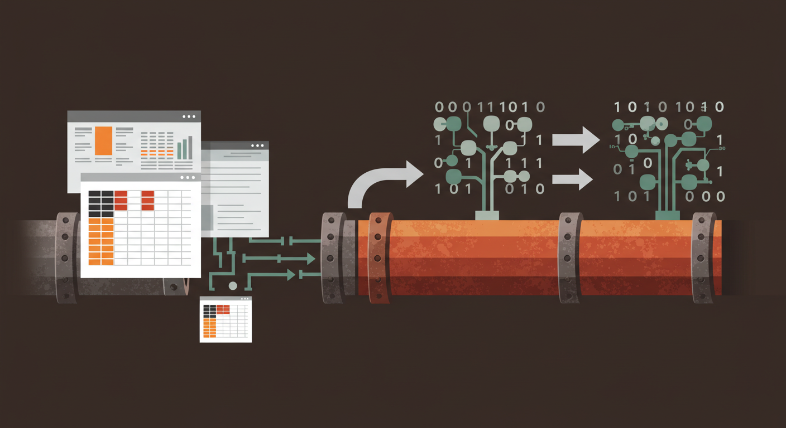

# Formualizer 🚀

<p align="center">
  
</p>

[](https://github.com/psu3d0/formualizer/actions/workflows/ci.yml)
[](https://github.com/psu3d0/formualizer/actions/workflows/security-audit.yml)

**Formualizer** is a lightning-fast, flexible formula processing library that brings spreadsheet-style calculations to your Rust applications! This **headless** engine provides a powerful **tokenizer**, **AST parser**, and **interpreter** for evaluating Excel-like formulas.

## ✨ Features

- **⚡ Blazing-Fast Tokenization**: Transform formula strings into structured tokens with our optimized tokenizer.
- **🧩 Robust Parsing**: Build accurate Abstract Syntax Trees (AST) from tokens with advanced error handling.
- **🧮 Flexible Interpretation**: Evaluate formulas in any context you define - from spreadsheets to custom data structures.
- **🔌 Ultimate Extensibility**: Easily create custom functions, range references, and structured table references that fit your specific needs.
- **🛠️ Modular Design**: Use only what you need with our feature flags - tokenizer, parser, interpreter or all components together.

## 📦 Installation

Add Formualizer to your Rust project:

```
cargo add formualizer
```

```toml
[dependencies]
formualizer = { git = "https://github.com/psu3d0/formualizer.git" }
```

### Feature Flags

Customize your build with these feature flags:

```toml
# Only include the tokenizer
formualizer = { git = "https://github.com/psu3d0/formualizer.git", default-features = false }

# Include tokenizer and parser
formualizer = { git = "https://github.com/psu3d0/formualizer.git", default-features = false, features = ["parser"] }

# Include the full stack (default)
formualizer = { git = "https://github.com/psu3d0/formualizer.git" }
```

## 🔍 How It Works

Formualizer's architecture consists of three powerful components:

1. **Tokenizer (`tokenizer.rs`)**
   - Transforms formula strings like `=SUM(A1:B2)` into a structured token sequence.
   - Works standalone or as part of the full processing pipeline.

2. **Parser (`parser.rs`)**
   - Converts tokens into a robust Abstract Syntax Tree (AST).
   - Handles operator precedence, function calls, and nested expressions with ease.


**Formualizer makes no assumptions about your implementation**. Your approach to dependency resolution, formula registry, and so on is up to you. In line with this ethos, you can opt to use only the parts you need. Both the parser and interpreter are under feature flags - use only what you need!

## 🚀 Usage

### Tokenizing a Formula

```rust
use formualizer::tokenizer::Tokenizer;

let formula = "=SUM(A1:B2)";
let tokenizer = Tokenizer::new(formula).unwrap();

for token in tokenizer.items {
    println!("Token: {} ({:?})", token.value, token.token_type);
}
```

### Parsing a Formula

```rust
use formualizer::parser::Parser;
use formualizer::tokenizer::Tokenizer;

let tokenizer = Tokenizer::new("=A1+B2").unwrap();
let mut parser = Parser::new(tokenizer.items, false);
let ast = parser.parse().unwrap();
println!("Parsed AST: {:?}", ast);
```

